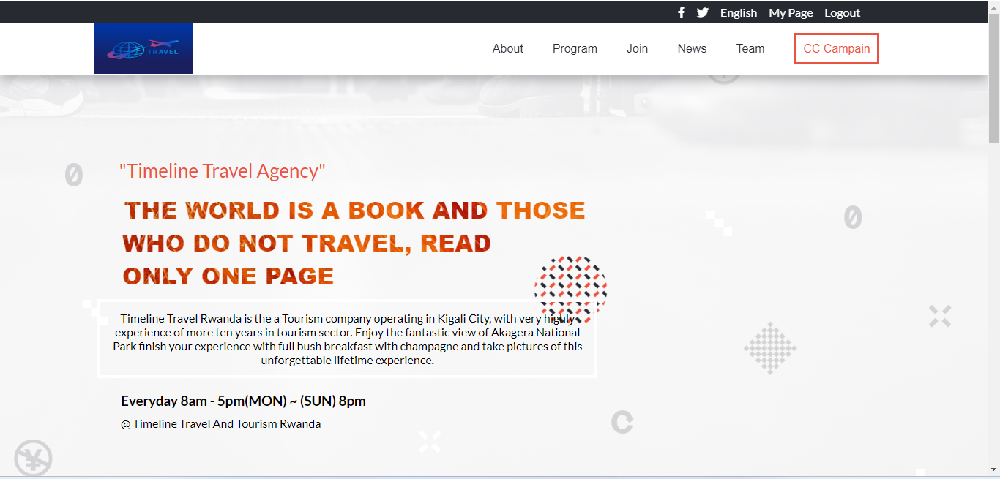
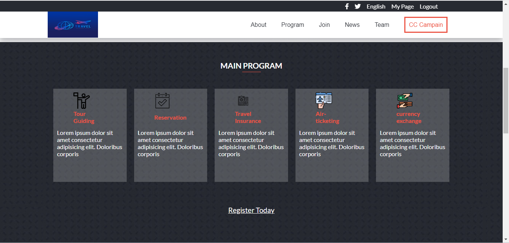
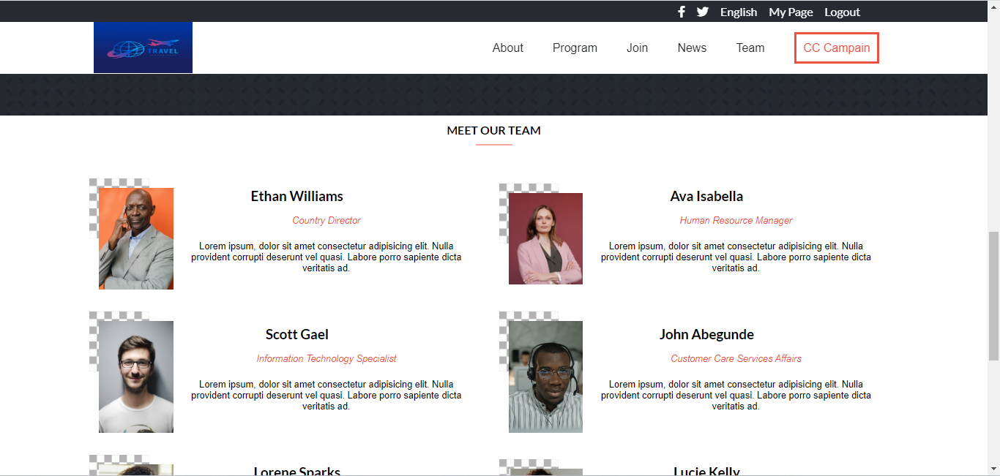

# Module One Capstone Project

> This project built to show accomplishment work.
>  >  > 
> Capstone Project is project which highlights and showcases samples of some of best work, learning progress, and academic achievement in software development.

## Built With

- HTML
- CSS
- JavaScript

## Live Demo

(https://nezerwa.github.io/Module1-capstone-project/index.html)

## Getting Started

To get a local copy open and running follow these simple example steps.

### Setup

- Download or Clone Repository.
- In case you downloaded repository Extract ZIP Folder.

### Installation

- One folder in your text editor.
- Run `npm install` command to install all dependencies.
  _N.B: Make sure that you have node installed in your commputer, if not [Download Node](https://nodejs.org/en/)_

### Usage

Navigate to the Folder and Double Click on index.html File or you can simply open project with live server in your editor.
Project will open and running to your Browser.
Learn more about [Live Server](https://marketplace.visualstudio.com/items?itemName=ritwickdey.LiveServer#:~:text=Shortcuts%20to%20Start%2FStop%20Server&text=Open%20a%20HTML%20file%20and,on%20Open%20with%20Live%20Server%20.&text=Open%20the%20Command%20Pallete%20by,Server%20to%20stop%20a%20server)

## Author

- GitHub: [@Nezerwa](https://github.com/Nezerwa)
- LinkedIn: [Nezerwa](https://www.linkedin.com/in/Nezerwa)

## :handshake: Contributing

Contributions, issues, and feature requests are welcome!
Feel free to check the [issues page](../../issues/).

## Show your support

Give a :star:️ if you like this project!

## Acknowledgments

- Great appreciation to Microverse community.

## :memo: License

This project is [MIT](./MIT.md) licensed.
